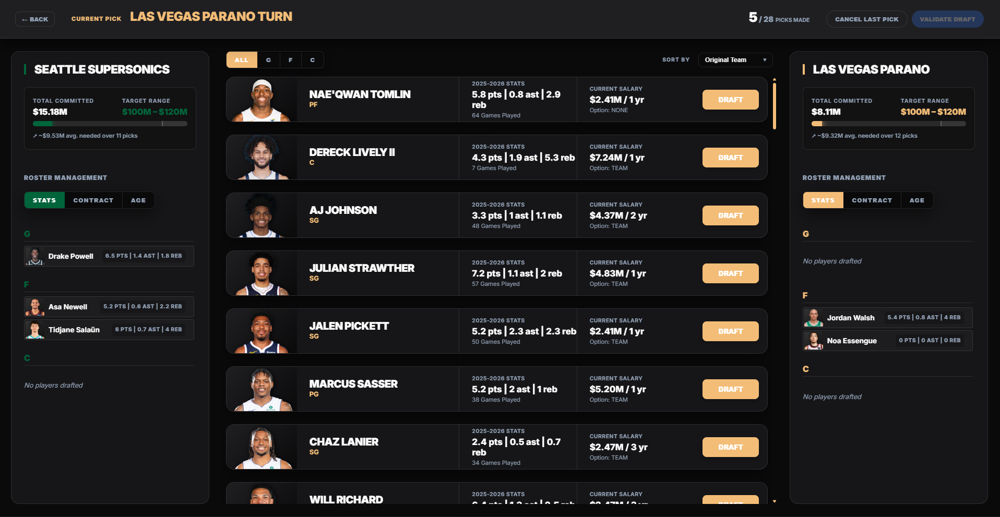
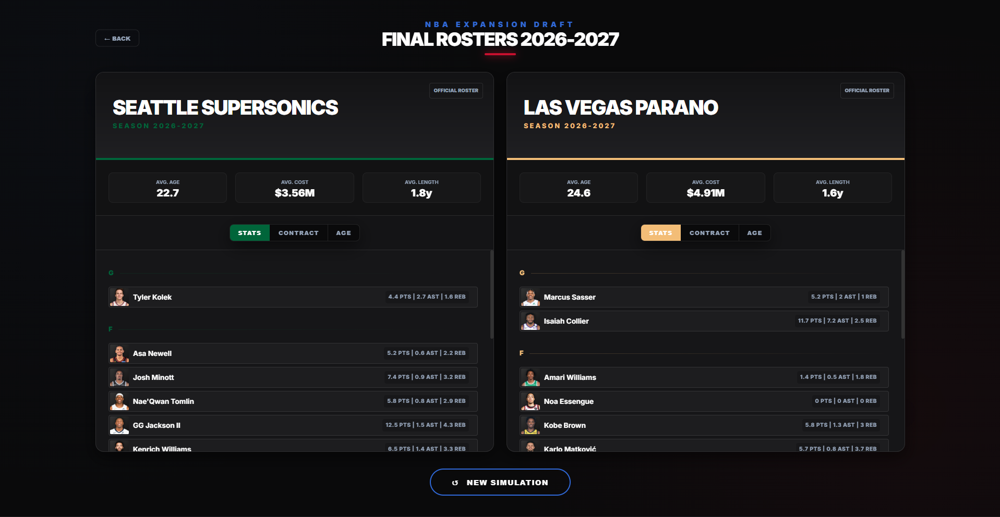

# NBA Draft Client

**Live Demo:** [nba-expansion-draft.fr](https://nba-expansion-draft.fr/home)

A modern, responsive interface built with Angular to manage and visualize the NBA Expansion Draft process.



This project serves as the **Frontend** layer of the NBA Draft ecosystem. 

It provides a seamless user experience for exploring player statistics, managing payroll budgets, and simulating the drafting process for a new franchise. 



It natively consumes data exposed by the **NBA Draft API** (`https://github.com/julien-croynar/nba-draft-api`).

## Key Features

* **Interactive Dashboard:** Comprehensive visualization of player statistics and active contracts.
* **Expansion Draft Management:** Core team selection logic featuring real-time Salary Cap calculations.
* **Scalable Architecture:** Built strictly following the "Core/Shared/Features" pattern for high maintainability.
* **Optimized Performance:** Leverages **Angular Signals** for granular, highly reactive change detection.

## Technologies Used

* **Angular 19+** (Signals, Standalone Components, Control Flow)
* **Angular Material** (UI Components & Design System)
* **TypeScript** (Strict typing and Path Aliases)
* **RxJS** (Asynchronous data stream management)
* **Nginx** (Reverse Proxy & Static file server)
* **Docker & Docker Compose** (Deployment orchestration)

## Project Structure

```plaintext
src/app/
├── core/          # Singleton services, guards, interceptors, and global models
├── shared/        # Reusable UI components, pipes, and directives
├── features/      # Business modules (Selection, Dashboard, Team Summary)
├── environments/  # Environment-specific configurations (Dev, Prod)
└── app.config.ts  # Application configuration (Providers, Routes)
```

## Getting Started

### Prerequisites
* Node.js (v20+)
* Angular CLI

### Local Development
1. Clone the repository: ``git clone https://github.com/julien-croynar/nba-draft-client.git``

2. Install dependencies: `npm install`

3. Start the development server: `ng serve`

4. Navigate to: `http://localhost:4200`


## Deployment Strategy

The application is architectured to be production-ready through containerization:
* **Containerization:** Designed to run within a Docker environment using a multi-stage build (Node.js for building, Nginx for serving).
* **Orchestration:** Fully compatible with Docker Compose to run in sync with the NBA Draft API and MySQL database 
* **Environment Injection:** Built to handle dynamic environment configurations for seamless transitions between development and production stages.
